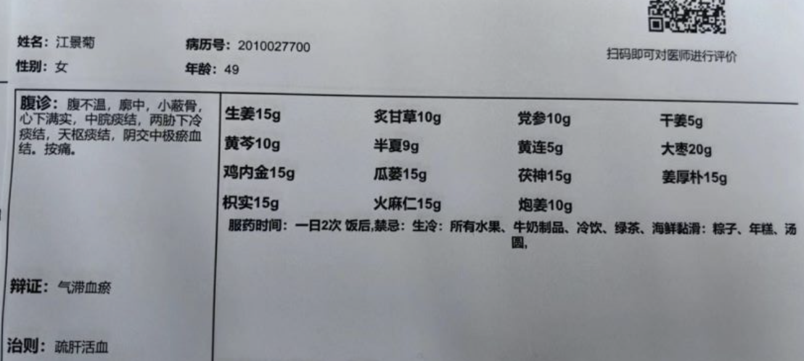
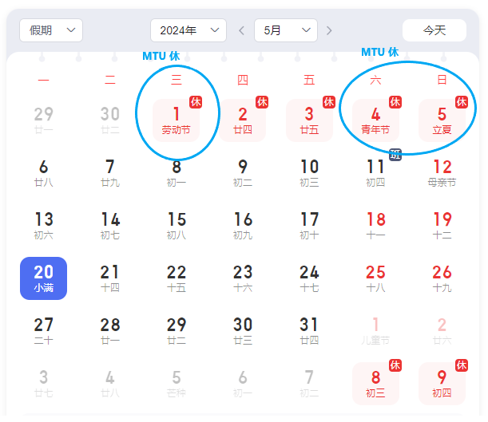

# 梁立平的随手记

# 🍹 随便乱写

[https://www.freepik.com/free-vector/minimal-geometric-landing-page_5934206.htm#query=green%20website%20templates&position=13&from_view=keyword&track=ais&uuid=8a1e7b64-20d9-4a52-baa5-5e05a08b8f64](https://www.freepik.com/free-vector/minimal-geometric-landing-page_5934206.htm#query=green%20website%20templates&position=13&from_view=keyword&track=ais&uuid=8a1e7b64-20d9-4a52-baa5-5e05a08b8f64)

[https://www.freepik.com/free-psd/nature-adventure-landing-page-template-with-vegetation-leaves_27644665.htm#query=green%20website%20templates&position=44&from_view=keyword&track=ais&uuid=8a1e7b64-20d9-4a52-baa5-5e05a08b8f64](https://www.freepik.com/free-psd/nature-adventure-landing-page-template-with-vegetation-leaves_27644665.htm#query=green%20website%20templates&position=44&from_view=keyword&track=ais&uuid=8a1e7b64-20d9-4a52-baa5-5e05a08b8f64)

#### **Employment Cost Index (NAICS)**

[https://zhuanlan.zhihu.com/p/635077265](https://zhuanlan.zhihu.com/p/635077265)

清洗链条：

1. 准备工具：小盆（热水 + 洗洁精），大桶（清水），刷子，牙刷，平头螺丝刀，链条油，不怎么用的抹布
2. 清水冲一下，刷子、牙刷用用洗洁液刷它，清不掉的用螺丝刀刮
3. 清水冲掉洗洁液，抹布抹干，在大太阳下晒干
4. 上[链条油](https://zqq5s4uymw.feishu.cn/docx/JM9vdvlv8o54L2xq0OPc25fmndh)，静止 5 分钟吸收，擦干多余的油

分析方向：cluster 看那些同等的 module/engine 离群

wrb 能不能看到很多信息比如 failure code 来做 cluster

pca 降维来做 cluster 不然太稀疏

[https://product.lifeapp.pingan.com.cn/life-policy/external/common/queryElectronicPolicy.uncheck?token=PK69dc033a2b&fileType=A](https://product.lifeapp.pingan.com.cn/life-policy/external/common/queryElectronicPolicy.uncheck?token=PK69dc033a2b&fileType=A)

5 月 21 日   里程：11580

[https://www.zhihu.com/question/28052564/answer/411181640](https://www.zhihu.com/question/28052564/answer/411181640)

注意力集中，在附近逛逛

骑行 1-22    1-25  骑行

# 🚀 长期看板

2023 年 11 月 24 日

1. 遇到两种情绪，他们对心智带宽有不同的影响

事件 1，听到老承班主任要请家长开会的时候，猜测可能是有打架问题，恐惧情绪像芝麻糊那样占满了通道，但明显通过演戏角度是可以暂时扩大通道的，只是它有点难缠，一会又关上了，这需要我们持续关注通道的情况。

事件 2，遇到 lp 指出 lm 给糖老妹吃的事，存在较多愤怒的情绪，遇到同事无礼的对待，刘佳疯狂地想贬低对方。这种愤怒情绪计划瞬间挤满了通道，等缓过来一点一个念头又挤满一次。对策是在遇到小冒犯的时候就设定一个对方的预期，尝试加大 gap

2023 年 11 月 28 日

ventol 时不时会过来看看我的工作，经常就会发现有些工作很重复或者有些东西没想清。主要是脑里面有想法，但是比较模糊，这时候直觉的力量就比较大，让我跟着苯法走，为什么会模糊不清呢？我觉得有两个原因，1. 脑袋里面塞满东西，想法刚有就被冲走。这时候要做的是像收拾家里一样，静下来收拾一下。2. 没有抓住想法，当它出现时，快速写下来或者放下其他东西，把想法清晰化。

2023 年 11 月 29 日

我还是比较健忘或者说不小心，发财务的静态表格错漏很多。我需要各种 check list 来帮助我

刚刚被刘佳的不帮助想法给激怒了，好的是我居然可以在途中观察到，原因应该是最近一直在关注这个事情，把情绪和察觉捆绑在一起了，一定要加强这个绑定

2023 年 12 月 7 日

我的金星在天蝎，我应该对一些背后控制，或者黑暗中探索东西的事情感兴趣。比如我喜欢 api 寻宝，喜欢悬疑小说。可以继续发掘类似的兴趣

2023 年 12 月 9 日

今天明显感觉到尘埃想法出现时(貌似是一些请问的情绪产生时) 比如被超车，突然进入了观察模式，好像设置的桩出现了，要继续强化。我想一些比较强的情绪会淹没这个桩，但起码先让我有机会进入观察模式。能明显感觉到尘埃阻挡了我进入当下

2024 年 1 月 7 日

尘今天假装观察者出现了，分辨他们俩的方式很简单，观察者不评论，尘一定是带着某种思维出现的

2024 年 1 月 10 日

老承明显受软不受硬，要慢慢和他说。就像今天流鼻血那样，批评他不去清理完全没作用，而是解析原理他好受一些。

"对方不是和我对着干"，这是臣服的第一步，而且这也是完全没毛病的

今天老妈要买手表给老承的时候，我一下就怒了，但一下又意识到有问题，但明显我并没有临在，这可能是某种形式的条件反射，进去临在的桩。

2024 年 3 月 23 日

马铃薯放冰箱，潮湿关门，下地不吃饭，早上说话小声点

要积极站队，比如讨论老真的奶粉的时候，不然就是不作为

2024 年 3 月 30 日

临在，或者我是观察者的想法，不是单纯的无思想，因为它决定了可我在观察的对象，比如在自观的时候对象就是自己的下一个想法，但也可以是树上的叶子。和平时状态唯一不一样的是我知道我在观察，而不是迷失在被观察的想法或场景之中

2024 年 4 月 5 日

所有预期都是室友说的，我只要观察

2024 年 4 月 18 日

清醒我们的预期

念身不求无病 - 有病不一定是坏事，它能让我们放弃一些杂念，更能看清一些事情

处世不求无难 - 如果事情太顺会让人麻痹，更大的麻烦就会来

交情不求益我

2024 年 4 月 19 日

生活中很多事，并没有答案。怎么做，都不会有对错，关键在于，你是否真实地活过。

　　不用伪装，不用畏惧别人的眼光，不用找借口，真实地活几十年。
